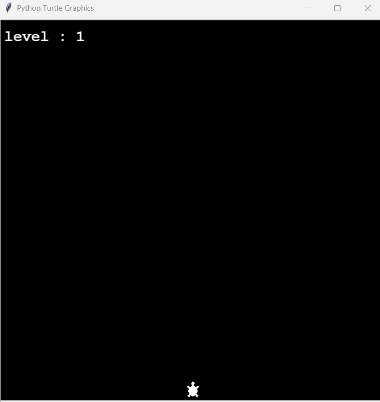

# Turtle Crossing Game

<p align="center">
    
</p>

A simple Turtle Crossing Game built using Python and the Turtle graphics module. This project is part of my Python learning journey and helped me understand object-oriented programming, collision detection, animation, and game development concepts.

## Features

- Control the turtle using the Up Arrow key.
- Randomly generated moving cars.
- Collision detection between the turtle and cars.
- Increasing game difficulty with each level.
- Level tracking and game over screen.

## Technologies Used

- Python
- Turtle Graphics
- Object-Oriented Programming (OOP)

## Project Structure

```
Python-Turtle-Crossing-Game/
│
├── main.py
├── player.py
├── car_manager.py
├── scoreboard.py
├── preview.gif
└── README.md
```

## How to Run

1. Clone the repository.

```bash
git clone https://github.com/YOUR_USERNAME/Python-Turtle-Crossing-Game.git
```

2. Open the project folder.

3. Run the following command.

```bash
python main.py
```

## Controls

| Key | Action |
|-----|--------|
| Up Arrow | Move Forward |

## What I Learned

- Creating animations using the Turtle module.
- Managing multiple objects using classes.
- Detecting collisions between game objects.
- Increasing game difficulty dynamically.
- Organizing a Python project into multiple modules.
